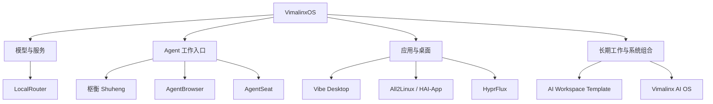

# VimalinxOS

**让 AI 能在自己的电脑上，把事情做完。**

面向人和 AI Agent 的 Linux 工作环境与开源基础设施。

[简体中文](README.md) · [English](README.en.md) · [开源项目](#开源项目) · [从哪里开始](#从哪里开始)

---

VimalinxOS 希望把电脑变成 Agent 可以理解和使用的工作环境。你表达目标，Agent 发现可用能力、调用模型与工具、操作应用、检查结果，并在遇到错误时继续诊断和恢复。

围绕这个方向，我们正在建设一组可以独立使用的开源项目，覆盖 API 网关、Agent 会话、浏览器、桌面应用操作、Web 桌面、Linux 应用适配和长期工作区。

**这个仓库是 VimalinxOS 的公开总览与项目导航。** 各组件在自己的仓库中开发、发布和维护。本页描述整体方向，不代表已经交付了统一安装镜像或完成了所有组件的端到端集成。

## 开源项目

以下 9 个仓库于 **2026-09-06** 核实为公开、非 fork 仓库。具体功能、平台要求、安装步骤与发布状态，请以对应仓库的当前文档和发行说明为准。

| 项目 | 它提供什么 | 入口 |
| --- | --- | --- |
| **LocalRouter** | 在本机集中管理模型 API、服务接口和调用身份，让 Agent 发现并选择可用操作。 | [仓库](https://github.com/vimalinx/LocalRouter) · [发行版](https://github.com/vimalinx/LocalRouter/releases) |
| **枢衡 Shuheng** | 本地 Agent 的终端控制面，提供会话管理、执行调度以及长期工作所需的控制入口。 | [仓库](https://github.com/vimalinx/Shuheng) · [发行版](https://github.com/vimalinx/Shuheng/releases) |
| **AgentSeat** | 为 Agent 提供单个 GUI 应用内的独立观察和输入能力，保留人的鼠标、键盘、宿主焦点和剪贴板。 | [仓库](https://github.com/vimalinx/AgentSeat) · [发行版](https://github.com/vimalinx/AgentSeat/releases) |
| **AgentBrowser** | 按 Agent 所有权管理真实浏览器的启动、复用和清理，以及端口、配置目录和可选远程连接。 | [仓库](https://github.com/vimalinx/vimalinx-agent-browser) |
| **Vibe Desktop** | 在自己的机器上运行 Web 桌面，通过本地 WebApp 管理器组织和运行应用。 | [仓库](https://github.com/vimalinx/vibedesktop) · [发行版](https://github.com/vimalinx/vibedesktop/releases) |
| **Vimalinx AI OS** | 系统组合与发行控制面，围绕组件清单、健康检查和版本化发行组织 Arch Linux / Hyprland 工作环境。 | [仓库](https://github.com/vimalinx/vimalinx-ai-os) · [发行版](https://github.com/vimalinx/vimalinx-ai-os/releases) |
| **All2Linux / Universal Linux Port** | 用 Agent Skill、HAI-App 契约和参考应用，帮助旧应用移植或重构为同时适合人与 Agent 使用的 Linux 软件。 | [仓库](https://github.com/vimalinx/universal-linux-port) · [发行版](https://github.com/vimalinx/universal-linux-port/releases) |
| **AI Workspace Template** | 为长期工作保存任务状态、证据、决定和交接信息，让不同 Agent 能接续维护同一工作区。 | [仓库](https://github.com/vimalinx/ai-workspace-template) · [发行版](https://github.com/vimalinx/ai-workspace-template/releases) |
| **HyprFlux** | 从基础 Arch Linux 安装构建 Hyprland 桌面，提供桌面配置、硬件 Profile 和模块化配置叠加。 | [仓库](https://github.com/vimalinx/HyprFlux) |

可供工具读取的项目清单见 [projects.json](projects.json)。各项目保留自己的许可证，具体条款见对应仓库；本总览不会改变组件的授权条件。

## 这些项目在整体中承担什么

下面是能力分工图，表示各项目的定位；连线不表示已经验证的运行依赖或集成关系。

我们希望这些能力具备几个共同特征。

- **可发现**：Agent 能查到系统提供了什么、怎样调用、有哪些限制。
- **可操作**：模型、浏览器、终端和应用都有明确的操作入口。
- **可验证与恢复**：操作留下结果与证据，失败后有条件继续诊断、重试或回退。
- **能长期接续**：重要状态和工作成果能跨会话保留。
- **尊重人的工作环境**：组件明确各自的权限、输入和资源边界。

这些是项目的共同建设方向。具体保证以各组件已实现的契约为准。

## 从哪里开始

按你当前的需求选择一个组件，就可以开始了解和使用。

| 你想做什么 | 先看哪个项目 |
| --- | --- |
| 统一接入已有的模型 API 和服务 | [LocalRouter](https://github.com/vimalinx/LocalRouter#readme) |
| 让 Agent 操作一个桌面应用 | [AgentSeat](https://github.com/vimalinx/AgentSeat#readme) |
| 给多个 Agent 分别管理浏览器 | [AgentBrowser](https://github.com/vimalinx/vimalinx-agent-browser#readme) |
| 管理本地 Agent 会话与执行 | [枢衡 Shuheng](https://github.com/vimalinx/Shuheng#readme) |
| 把本地 Web 应用放进桌面 | [Vibe Desktop](https://github.com/vimalinx/vibedesktop#readme) |
| 让 Agent 长期维护一个项目目录 | [AI Workspace Template](https://github.com/vimalinx/ai-workspace-template#readme) |
| 移植应用，并为 Agent 提供语义操作接口 | [All2Linux](https://github.com/vimalinx/universal-linux-port#readme) |
| 了解系统组合或搭建 Arch / Hyprland 桌面 | [Vimalinx AI OS](https://github.com/vimalinx/vimalinx-ai-os#readme) · [HyprFlux](https://github.com/vimalinx/HyprFlux#readme) |

公开仓库与开发中的版本可能处于不同阶段。安装时请阅读所选版本的文档；组件所需的模型服务、账号或硬件由其自身文档说明。

## 参与项目

总览介绍、项目链接与整体方向的讨论，可以在[本仓库 Issues](https://github.com/vimalinx/VimalinxOS/issues)提出。具体组件的问题、功能建议和代码贡献，请前往对应项目。

维护者：[Vimalinx](https://github.com/vimalinx)。
